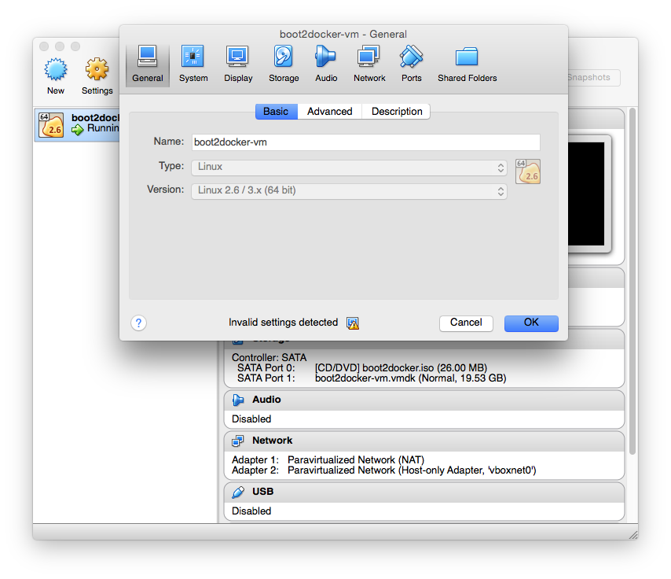
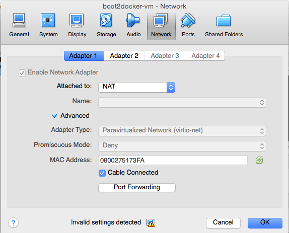

About docker-machine
--------------------

docker-machine is used to manage virtual machines which can host docker
instances. It can be used to spin up docker hosts in Google Compute Engine, AWS,
and other platform providers. While in general this the kind of idea only person
invested in bad technology would make, it's useful for developers who want the
convenience of docker on OS's like Mac and Windows. docker-machine allows those
users to spin up one lightweight VM to host all their docker containers.

Download and Install for OS X
=============================

docker-machine is distributed with docker 1.8+ which you should install with brew. If you
don't have brew you consider opening up Powerpoint and making presentations for a
living.

:code:`brew install docker`

The other requirement is Virtualbox 4 so install that from
https://www.virtualbox.org/wiki/Download_Old_Builds_4_3.

Next create a host to house your docker instances:

:code:`docker-machine create --virtualbox-hostonly-cidr "192.168.240.1/24" --driver virtualbox dev`

You now have a virtualbox instance running the boot2docker.iso. This instace has the docker
server tools installed and will accept commands from the docker client running your local
command line. To configure the local docker command tos talk to the virtualbox docker server
follow the output from the previous command, which tells you to this:

:code:`eval "$(docker-machine env dev)"`

With that you can run docker images... but if you want to work use them to work with local
files or provide access to users that on your computer - say for looking at webpage - you've
got a few more steps.

Let's mount your /Users directory into the VirtualBox instance

.. code:: bash

  docker-machine stop dev
  VBoxManage sharedfolder add dev --name /Users --hostpath /Users
  docker-machine start dev

Port Forwarding
###############

It's time to get GUI. Open VirtualBox in the UI.

.. figure:: screenshots/vb-main.png
    :width: 550px
    :align: center

Select the 'dev' machine on the left then click 'Settings'.

Click 'Network' in the modal dialog that pops up.

Click 'Port Forwarding' and ad a forward for 8000 to 8000 and any other ports you want
accessible to the world.

.. figure:: screenshots/vb-port-forward-initial.png
    :width: 550px
    :align: center
